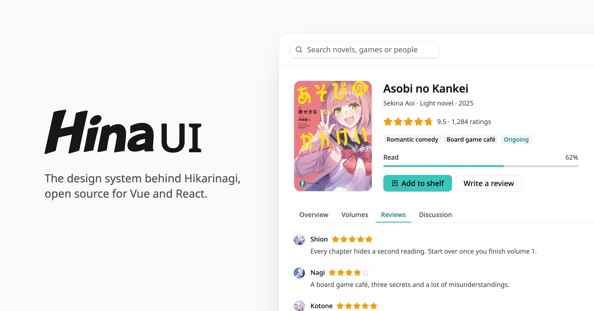

<picture>
  <source media="(prefers-color-scheme: dark)" srcset=".github/assets/banner-dark.png">
  
</picture>

<p align="center"><a href="./README.md">English</a> | 中文</p>

基于 [Tailwind CSS v4](https://tailwindcss.com) 构建。

- **深色模式与紧凑模式** 在外层容器设置一个属性，整片界面随之切换，组件不必逐个适配。
- **外观可调** 颜色、圆角、动效时长都是 CSS 变量，覆盖变量即可自定义外观。
- **无障碍** 焦点管理、键盘操作与屏幕阅读器语义开箱即用。
- **排版与骨架齐全** 不写原生标签也能快速搭建页面。

## 文档

- Vue：[hinaui.dev](https://hinaui.dev)
- React：[react.hinaui.dev](https://react.hinaui.dev)

## 安装

```bash
pnpm add @hina-ui/vue
# 或
pnpm add @hina-ui/react
```

## 参与开发

版本管理和发布流程见[变更记录与发布](./.changes/README.md)。

[共享展示层](./packages/shared/README.md)负责样式、variants 和动效工具；框架组件及底层适配保留在各自的包内。

## 许可证

[MIT](./LICENSE)
